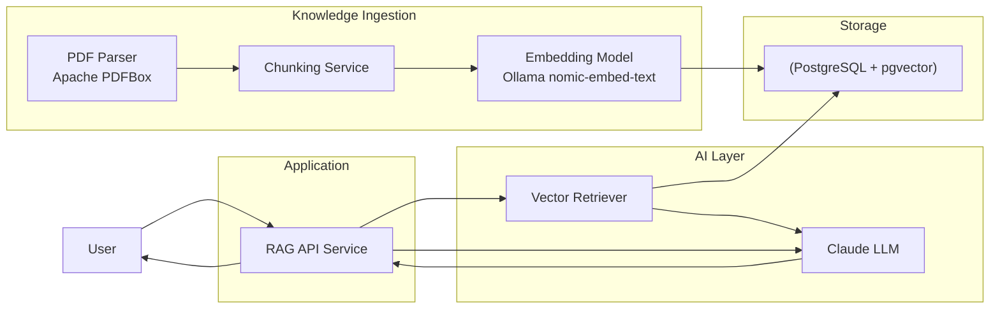
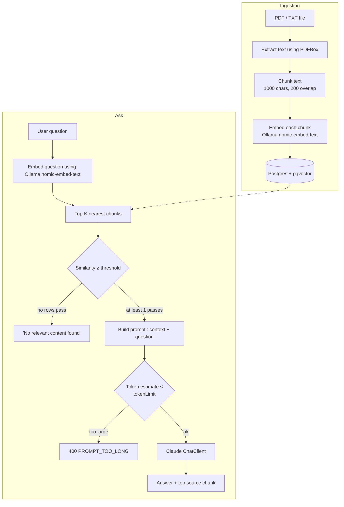

# RAG Demo — Spring AI + Claude + pgvector

A Retrieval-Augmented Generation (RAG) proof of concept: upload PDF/TXT documents, they get chunked and embedded into PostgreSQL (`pgvector`), and questions are answered by Claude using only the retrieved, relevance-filtered chunks as context.

## Tech Stack

| Layer | Technology |
|---|---|
| Language / Runtime | Java 21 |
| Framework | Spring Boot 4.1.0, Spring AI 2.0.0 |
| LLM | Anthropic Claude (model selected via `CLAUDE_MODEL` env var) |
| Embedding model | `nomic-embed-text` (768-dim), served by Ollama |
| Vector store | PostgreSQL 16 + `pgvector` extension |
| PDF parsing | Apache PDFBox |
| API docs | springdoc-openapi (Swagger UI) |
| Build | Maven |

## Architecture



## Flow Diagram

**ingestion** (upload → chunk → embed → store) and **ask** (embed question → similarity search → filter → prompt → Claude).




## Setup


## Prerequisites

- Java 21+
- Maven 3.9+
- Docker Desktop (for Postgres/pgvector and Ollama)
- An Anthropic API key

### 1. Clone and configure

```bash
git clone <repository-url>
cd clauderag-demo
```

Create a `.env` file in the project root

```env
CLAUDE_MODEL=claude-sonnet-5
CLAUDE_MODEL_INPUT_TOKEN_LIMIT=200000
ANTHROPIC_API_KEY=<your-anthropic-api-key>
APP_IMAGE=claude-rag-app-v1
```


### 2. Start Postgres (pgvector) + Ollama

```bash
docker compose up -d postgres ollama
```

This starts:
- `rag-postgres` — Postgres 16 with the `vector` extension, auto-running [`docker/init.sql`](docker/init.sql) to create `document_chunks_claude_llm (id, file_name, chunk_text, embedding vector(768))`
- `ollama` — embedding model runtime
- `pgadmin` (optional, also included) at [http://localhost:8080](http://localhost:8080)

### 3. Pull the embedding model into Ollama

```bash
docker exec -it ollama ollama pull nomic-embed-text
```

(If running Ollama natively instead of via Docker: `ollama pull nomic-embed-text`, and point `spring.ai.ollama.base-url` at `http://localhost:11434`.)

### 4. Run the application

**Option A — local dev (recommended for iterating):**

```bash
mvn spring-boot:run
```

Reads `.env` values as env vars (export them, or use an IDE run config / `dotenv` plugin) and connects to `localhost:5432` / `localhost:11434` as configured in [`application.yml`](src/main/resources/application.yml).

**Option B — fully containerized:**

```bash
mvn clean package -DskipTests
docker build -t claude-rag-app-v1 .
docker compose up -d
```

The `app` service in [`docker-compose.yml`](docker-compose.yml) runs the image named by `APP_IMAGE`, so it must be built first (there's no `build:` block in the compose file). The app is exposed on **host port 8081** (mapped to container port 8080).

### 5. Verify

- Swagger UI: `http://localhost:8080/swagger-ui/index.html` (or `:8081` when running via Docker Compose)
- Health check: upload a document, then ask a question (below).

## Configuration reference

| Property / env var | Default | Purpose |
|---|---|---|
| `app.table-name` | `document_chunks` (overridden to `document_chunks_claude_llm` in `application.yml`) | pgvector table used for both ingestion and retrieval |
| `app.similarity-threshold` | `0.75` | Minimum cosine similarity (0–1) a chunk must have to be used as context |
| `app.input-token-limit` / `CLAUDE_MODEL_INPUT_TOKEN_LIMIT` | — | Max estimated prompt tokens before rejecting with `PROMPT_TOO_LONG` |
| `CLAUDE_MODEL` | — | Anthropic model id (e.g. `claude-sonnet-5`) |
| `ANTHROPIC_API_KEY` / `API_KEY` | — | Anthropic API key |
| `spring.ai.ollama.base-url` | `http://ollama:11434` | Ollama endpoint for embeddings |


## Sample query and response


### Upload

**Request**
```bash
curl -X 'POST' \
  'http://localhost:8081/api/upload' \
  -H 'accept: */*' \
  -H 'Content-Type: multipart/form-data' \
  -F 'file=@Sample_Employee_Handbook_RAG_Test.pdf;type=application/pdf'
```
**Response**
```
Document uploaded Successfully
```

### Ask

**Request**

```bash
curl -G "http://localhost:8081/api/ask" --data-urlencode "q=Sick leave policy"
```

**Response** (`200 OK`, shape from [`AskResponse`](src/main/java/com/poc/rag/rag_demo/dto/AskResponse.java)):

```json
{
  "answer": "## Sick Leave Policy\n\nBased on the employee handbook:\n\n- **Annual Allocation:** Employees receive **12 days** of paid sick leave annually\n- **Medical Documentation:** May be required for absences exceeding **3 consecutive days**",
  "sourceChunk": "Sample Employee Handbook\nRAG Testing Document\nWorking Hours\nStandard working hours are 9:00 AM to 6:00 PM Monday through Friday. Employees may use\nflexible start times between 8:00 AM and 10:00 AM with manager approval.\nAnnual Leave Policy\nFull-time employees are entitled to 18 days of annual paid leave per calendar year. Unused leave\ncan be carried forward up to 5 days.\nSick Leave\nEmployees receive 12 days of paid sick leave annually. Medical documentation may be required for\nabsences exceeding 3 consecutive days.\nWork From Home\nEmployees may work remotely up to 3 days per week subject to team requirements and manager\napproval.\nTravel Policy\nBusiness travel must be approved before booking. Economy class should be used for domestic\nflights. Hotel reimbursement is limited to 7000 INR per night.\nExpense Reimbursement\nExpense claims must be submitted within 30 days. Approved reimbursements are processed in the\nnext payroll cycle.\nCode of Conduct\nEmployees must maintain professional behavi"
}
```

**No relevant match** (all 3 nearest chunks scored below `app.similarity-threshold`):

```json
{
  "answer": "I couldn't find anything relevant to that question in the document.",
  "sourceChunk": null
}
```

**Prompt too large** (`400 BAD REQUEST`, shape from [`ErrorResponse`](src/main/java/com/poc/rag/rag_demo/dto/ErrorResponse.java)):

```json
{
  "code": "PROMPT_TOO_LONG",
  "message": "Input exceeds model limit."
}
```

## Chunking strategy

- **Chunk size:** 1000 characters
- **Overlap:** 200 characters

Smaller, overlapping chunks keep embeddings focused (better similarity search) while preserving context across chunk boundaries. See [`DocumentService.chunkText`](src/main/java/com/poc/rag/rag_demo/service/DocumentService.java).

## Author

**Baby Satheeshkumar** — Senior Lead Engineer